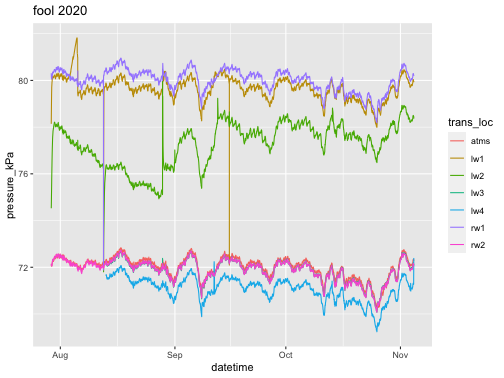

This script is used to clean water level data from HOBO water level loggers (U20L-04)
designed for surface water level measurements.
Cleaning and QA/QC steps include: 

1) removing bad data
2) converting stage to water depth
3) adjusting data for shifts in logger position
4) checking results against manual measurements.

Inputs are water level logger raw data (periodically downloaded .csvs) and a manual measurement spreadsheet specific to the site being reviewed

Setup

Package and function import from .R script


Additional functions
Functions that open and concatenate formatted data files


# {.tabset .tabset-fade}

## 2020 {.tabset .tabset-fade}

### Fool1 {.tabset .tabset-fade}


Quick raw plot of point data




```r
# Subset based on logger location within the transect
press_raw_list <- split(press_raw, press_raw$trans_loc)

# Write out single data frames
for (i in seq(press_raw_list))
  assign(paste0('press_raw_', press_raw_list[[i]]$trans_loc[i]), press_raw_list[[i]]) 
```

#### Atmospheric {.tabset .tabset-fade}

##### Complete timeseries
Create complete timeseries to identify any missing datetimes from the dataframe


- `The number of missing timesteps is 0`

##### Check raw pressure
1) Plot temperature for quick checks
Keep in mind that the the factory calibrated ranges are:
0° to 40°C (32° to 104°F)
 

```r
# Figure caption labels
abbr <- 'atms'
posit_nm <- 'atmospheric'
long_nm <- 'atmospheric'
```


2) Plot raw data with flag if raw level changes by more than 5%.


3) Manually identify points to be removed or corrected using the flagged plot


```r
# no corrections made for this atmospheric logger
bad_id_fc1_atms20 <-  c(0)

vert_correction_fc1_atms20<- data.frame(ID = c(0:1), offset=c(0))%>%
  mutate(cumOffset = cumsum(offset))
```


4) Vertical adjustments


```r
#function to make vertical correction and interpolate between missing values 
press_adj<- AdjPress(df=press_raw_atms, maxgap=8)%>%
    mutate(watershed = watershed)%>%
    mutate(site = site)%>%
    filter(ID > 3) %>% # beginning of data
    mutate(level_flag = ifelse(pressure_kPa < -65, 'Below Logger',
    ifelse(pressure_kPa > 75, 'Over Logger', 'In Range')))

#stageAdj<- AdjStage(maxgap=30)
```

##### Plot adjusted pressure


##### Export


```r
#stage_final <- stage_adj %>%
press_final <- press_adj %>%
      drop_na() %>%
      mutate(date = lubridate::date(datetime)) %>%
      mutate(time = format(datetime, format = "%H:%M")) %>%
        #dplyr::select(watershed, site, date, time, wtr_depth, level_flag) 
      dplyr::select(watershed, site, date, time, adj_press, level_flag) 
    
loc_site<- paste(watershed,site, sep='_') 

interfiles <- 'clean_data/stage_pressure'
file_path <- paste(getwd(), interfiles,year,watershed,site, sep='/')
#saveRDS(stage_final, file=paste0('data/cln/wtr_lvl_',loc_site,'.csv'))
write_csv(press_final, file=paste0(file_path, '/',site, 'atms_clean.csv'))
```

Generate simple df for among year plots


```r
# Simple df of adjusted values for stacked plot (see below)
simplefc1atms_20 <- press_adj %>%
  select(datetime, adj_press, site) %>%
  drop_na()
```

#### LW1 {.tabset .tabset-fade}


```r
mrg_press_adj <- as.data.frame(press_adj[,c('datetime','adj_press')])
  
stage_well <- merge(press_raw_lw1, mrg_press_adj, by = 'datetime') %>%
  rowid_to_column(var='ID') %>% #add an ID no to each row
  mutate(adj_h2opressure = pressure_kPa - adj_press) %>%
  mutate(hobo_wtr_depth_cm = (adj_h2opressure*9.98) + 1.6) # kPa range 0-145, factory calibrated 69kPa to 145 kPa, range at 10,000ft 0 to 7m or 0 to 4m below 10,000 plus 1.6cm for logger sensor height
 
#water level (h) is given by h=(P-Pr)/(rho * g) where P is the pressure measured by the sensor in the water, Pr is the pressure measured by the reference sensor (atmospheric pressure), rho is the density of the water in the stream, and g is the acceleration due to gravity.

#https://www.onsetcomp.com/files/manual_pdfs/17153-G%20U20L%20Manual.pdf
```

##### Complete timeseries
Create complete timeseries to identify any missing datetimes from the dataframe


- `The number of missing timesteps is 0`

##### Check raw pressure
1) Plot temperature for quick checks
 

```r
# Figure caption labels
abbr <- 'lw1'
posit_nm <- 'well'
long_nm <- 'left ripaian well'
```


2) Plot raw pressure data with flag if raw level changes by more than 5%.


##### Clean raw stage
1) Plot raw water depth data with flag if raw level changes by more than 5%.


2) Manually identify points to be removed or corrected using the flagged plot


```r
bad_id_fc1_well20 <-  c(2034:2050,6935 )

vert_correction_fc1_well20<- data.frame(ID = c(0:1), offset=c(0))%>%
  mutate(cumOffset = cumsum(offset))
```


3) Vertical adjustments


```r
#function to make vertical correction and interpolate between missing values 
stage_adj<- AdjStage(df=stage_well, maxgap=8) %>%
    mutate(watershed = watershed) %>%
    mutate(site = site) %>%
    filter(ID > 30) %>% # beginning of data
    mutate(level_flag = ifelse(pressure_kPa < 0, 'Below Logger',
    ifelse(pressure_kPa > 145, 'Over Logger', 'In Range')))

#stageAdj<- AdjStage(maxgap=30)
```

Plot adjusted values only:


4) Check manual measurements - stream measurements performed from caprod post


```r
manMeas <- manualMeas  %>%
      #timezone set to MST, change if loggers used MDT/MST
  mutate(datetime = round_date(mdy_hm(datetime, tz='America/Phoenix'),'30 minutes')) %>% 
  mutate(water_depth = dep_to_bed-dep_to_water) %>% 
  filter(., site == 'fc1' & position == 'lw1' )
  
cols <- c('watershed', 'site', 'position', 'tech')
manMeas[cols] <- lapply(manMeas[cols], factor) 
```


```r
#choose a static depth to bed value. Here we are using a mean of manual bed measurements from the top of the caprod post
stat_to_bed <- manMeas%>%
  summarize(mean_dep_to_bed = mean(dep_to_bed,na.rm=T))%>%
  pull(mean_dep_to_bed)

manMeas_fil <- manMeas %>%
      dplyr::rename(., wtr_depth_not_static = water_depth) %>%
      mutate(man_wtr_dep_static = stat_to_bed - dep_to_water)
### 10 to convert mm to cm

# am not using this until cross-year comparison
depth_offset <- manMeas_fil %>%
  slice_max(datetime) %>%
  left_join(stage_adj %>%
              dplyr::select(datetime, adj_stage)) %>%
  mutate(depth_offset = man_wtr_dep_static - adj_stage)%>%
  pull(depth_offset)
```

Manual adjustments: 


```r
#start with 0 value, change if plots below suggest need for manual adjustment change value. 
manual_offset <- 0

stage_adj <- stage_adj%>%
  mutate(wtr_depth = adj_stage + manual_offset)
```

##### Manual measurements


```r
#plot difference between measured water depth and manual depth measurement
stage_adj <- as.data.frame(stage_adj)
stageAdj.man<- dplyr::left_join(manMeas_fil, stage_adj, by = 'datetime') %>%
      mutate(diff = man_wtr_dep_static-wtr_depth)

ggplot(stageAdj.man, aes(datetime, diff))+
  geom_point(size=3)+
  theme_minimal()
```


```r
#plot water level time series with manual measurements as points
stage_check_plot<- stage_adj%>%
  dplyr::left_join(.,manMeas_fil, by = 'datetime') %>%
  ggplot(aes(datetime,wtr_depth))+
    geom_line()+
    geom_point(aes(datetime, man_wtr_dep_static),size=3,col='red')

ggplotly(stage_check_plot)
```


##### Export


```r
stage_final <- stage_adj %>%
      drop_na() %>%
      mutate(date = lubridate::date(datetime)) %>%
      mutate(time = format(datetime, format = "%H:%M")) %>%
      dplyr::select(watershed, site, date, time, wtr_depth, level_flag) 
    
loc_site<- paste(watershed,site, sep='_') 

interfiles <- 'clean_data/stage_pressure'
file_path <- paste(getwd(), interfiles,year,watershed,site, sep='/')
#saveRDS(stage_final, file=paste0('data/cln/wtr_lvl_',loc_site,'.csv'))
write_csv(stage_final, file=paste0(file_path, '/',site, '_clean.csv'))
```


```r
# Simple df of adjusted values for stacked plot (see below)
simplefc1lw1_20 <- stage_adj %>%
  select(datetime, wtr_depth, site) %>%
  drop_na()
```

#### LW2 {.tabset .tabset-fade}


```r
mrg_press_adj <- as.data.frame(press_adj[,c('datetime','adj_press')])
  
stage_well <- merge(press_raw_lw2, mrg_press_adj, by = 'datetime') %>%
  rowid_to_column(var='ID') %>%
  mutate(adj_h2opressure = pressure_kPa - adj_press) %>%
  mutate(hobo_wtr_depth_cm = (adj_h2opressure*9.98) + 1.6)
```

##### Create complete timeseries 
Identify any missing datetimes from the dataframe


- `The number of missing timesteps is 0`

##### Check raw pressure
1) Plot temperature for quick checks


```r
# Figure caption labels
abbr <- 'lw2'
posit_nm <- 'well'
long_nm <- 'left upslope well'
```
 


2) Plot raw pressure data with flag if raw level changes by more than 5%.


##### Clean raw stage
1) Plot raw water depth data with flag if raw level changes by more than 5%.


2) Manually identify points to be removed or corrected using the flagged plot


```r
bad_id_fc1_well20 <-  c(2036:2115)

# well was pumped and logger downloaded on 8/12/20. Well was recharged after ~14hours. No other pump or download was recorded.

vert_correction_fc1_well20 <- data.frame(ID = c(0:1), offset=c(0))%>%
  mutate(cumOffset = cumsum(offset))
```


3) Vertical adjustments


```r
#function to make vertical correction and interpolate between missing values 
stage_adj <- AdjStage(df=stage_well, maxgap=80) %>%
    mutate(watershed = watershed) %>%
    mutate(site = site) %>%
    filter(ID > 75) %>% # beginning of data
    mutate(level_flag = ifelse(pressure_kPa < 0, 'Below Logger',
    ifelse(pressure_kPa > 145, 'Over Logger', 'In Range')))

#stageAdj<- AdjStage(maxgap=30)
```

Plot adjusted values only:


4) Check manual measurements - stream measurements performed from caprod post


```r
manMeas <- manualMeas %>%
      #timezone set to MST, change if loggers used MDT/MST
  mutate(datetime = round_date(mdy_hm(datetime, tz='America/Phoenix'),'30 minutes')) %>% 
  mutate(water_depth = dep_to_bed-dep_to_water) %>% 
  filter(., site == 'fc1' & position == 'lw2' )
  
cols <- c('watershed', 'site', 'position', 'tech')
manMeas[cols] <- lapply(manMeas[cols], factor) 
```


```r
#choose a static depth to bed value. Here we are using a mean of manual bed measurements from the top of the caprod post
stat_to_bed <- manMeas%>%
  summarize(mean_dep_to_bed = mean(dep_to_bed,na.rm=T))%>%
  pull(mean_dep_to_bed)

manMeas_fil <- manMeas %>%
      dplyr::rename(., wtr_depth_not_static = water_depth) %>%
      mutate(man_wtr_dep_static = stat_to_bed - dep_to_water)
### 10 to convert mm to cm

depth_offset <- manMeas_fil %>%
  slice_min(datetime) %>%
  left_join(stage_adj %>%
              dplyr::select(datetime, adj_stage)) %>%
  mutate(depth_offset = man_wtr_dep_static - adj_stage)%>%
  pull(depth_offset)
```

Manual adjustments: 


```r
#start with 0 value, change if plots below suggest need for manual adjustment change value. 
manual_offset <- 0

stage_adj <- stage_adj%>%
  mutate(wtr_depth = adj_stage + manual_offset)
```

##### Manual measurements


```r
#plot difference between measured water depth and manual depth measurement
stage_adj <- as.data.frame(stage_adj)
stageAdj.man<- dplyr::left_join(manMeas_fil, stage_adj, by = 'datetime') %>%
      mutate(diff = man_wtr_dep_static-wtr_depth)

ggplot(stageAdj.man, aes(datetime, diff))+
  geom_point(size=3)+
  theme_minimal()
```


```r
#plot water level time series with manual measurements as points
stage_check_plot<- stage_adj%>%
  dplyr::left_join(.,manMeas_fil, by = 'datetime') %>%
  ggplot(aes(datetime,wtr_depth))+
    geom_line()+
    geom_point(aes(datetime, man_wtr_dep_static),size=3,col='red')

ggplotly(stage_check_plot)
```


##### Export


```r
stage_final <- stage_adj %>%
      drop_na() %>%
      mutate(date = lubridate::date(datetime)) %>%
      mutate(time = format(datetime, format = "%H:%M")) %>%
      dplyr::select(watershed, site, date, time, wtr_depth, level_flag) 
    
loc_site<- paste(watershed,site, sep='_') 

interfiles <- 'clean_data/stage_pressure'
file_path <- paste(getwd(), interfiles,year,watershed,site, sep='/')
#saveRDS(stage_final, file=paste0('data/cln/wtr_lvl_',loc_site,'.csv'))
write_csv(stage_final, file=paste0(file_path, '/',site, '_clean.csv'))
```


```r
# Simple df of adjusted values for stacked plot (see below)
simplefc1lw2_20 <- stage_adj %>%
  select(datetime, wtr_depth, site) %>%
  drop_na()
```

#### RW1 {.tabset .tabset-fade}


```r
mrg_press_adj <- as.data.frame(press_adj[,c('datetime','adj_press')])
  
stage_well <- merge(press_raw_rw1, mrg_press_adj, by = 'datetime') %>%
  rowid_to_column(var='ID') %>%
  mutate(adj_h2opressure = pressure_kPa - adj_press) %>%
  mutate(hobo_wtr_depth_cm = (adj_h2opressure*9.98) + 1.6)

#water density at 4C = 1, @15.6C = 0.999
```

##### Complete timeseries 
to identify any missing datetimes from the dataframe


- `The number of missing timesteps is 0`

##### Check raw pressure
1) Plot temperature for quick checks


```r
# Figure caption labels
abbr <- 'rw1'
posit_nm <- 'well'
long_nm <- 'right riparian well'
```


2) Plot raw pressure data with flag if raw level changes by more than 5%.


##### Clean raw stage
1) Plot raw water depth data with flag if raw level changes by more than 5%.


2) Manually identify points to be removed or corrected using the flagged plot


```r
bad_id_fc1_well20 <-  c(1031, 2032:2036)  # Aug 5 and 12 logger download were the only were values changed by 5% or more

vert_correction_fc1_well20<- data.frame(ID = c(0:1), offset=c(0))%>%
  mutate(cumOffset = cumsum(offset))
```


3) Vertical adjustments


```r
#function to make vertical correction and interpolate between missing values 
stage_adj<- AdjStage(df=stage_well, maxgap=8) %>%
    mutate(watershed = watershed) %>%
    mutate(site = site) %>%
    filter(ID > 3) %>% # beginning of data
    mutate(level_flag = ifelse(pressure_kPa < 0, 'Below Logger',
    ifelse(pressure_kPa > 145, 'Over Logger', 'In Range')))
```

Plot adjusted values only:


4) Check manual measurements - stream measurements performed from caprod post


```r
manMeas<- manualMeas %>%
      #timezone set to MST, change if loggers used MDT/MST
  mutate(datetime = round_date(mdy_hm(datetime, tz='America/Phoenix'),'30 minutes')) %>% 
  mutate(water_depth = dep_to_bed-dep_to_water) %>% 
  filter(., site == 'fc1' & position == 'rw1' )
  
cols <- c('watershed', 'site', 'position', 'tech')
manMeas[cols] <- lapply(manMeas[cols], factor) 
```


```r
#choose a static depth to bed value. Here we are using a mean of manual bed measurements from the top of the caprod post
stat_to_bed <- manMeas%>%
  summarize(mean_dep_to_bed = mean(dep_to_bed,na.rm=T))%>%
  pull(mean_dep_to_bed)

manMeas_fil <- manMeas %>%
      dplyr::rename(., wtr_depth_not_static = water_depth) %>%
      mutate(man_wtr_dep_static = stat_to_bed - dep_to_water)
### 10 to convert mm to cm

depth_offset <- manMeas_fil %>%
  slice_min(datetime) %>%
  left_join(stage_adj %>%
              dplyr::select(datetime, adj_stage)) %>%
  mutate(depth_offset = man_wtr_dep_static - adj_stage)%>%
  pull(depth_offset)
```

Manual adjustments: 


```r
#start with 0 value, change if plots below suggest need for manual adjustment change value. 
manual_offset <- 0

stage_adj <- stage_adj%>%
  mutate(wtr_depth = adj_stage + manual_offset)
```

##### Manual measurements


```r
#plot difference between measured water depth and manual depth measurement
stage_adj <- as.data.frame(stage_adj)
stageAdj.man<- dplyr::left_join(manMeas_fil, stage_adj, by = 'datetime') %>%
      mutate(diff = man_wtr_dep_static-wtr_depth)

ggplot(stageAdj.man, aes(datetime, diff))+
  geom_point(size=3)+
  theme_minimal()
```


```r
#plot water level time series with manual measurements as points
stage_check_plot<- stage_adj%>%
  dplyr::left_join(.,manMeas_fil, by = 'datetime') %>%
  ggplot(aes(datetime,wtr_depth))+
    geom_line()+
    geom_point(aes(datetime, man_wtr_dep_static),size=3,col='red')

ggplotly(stage_check_plot)
```


##### Export


```r
stage_final <- stage_adj %>%
      drop_na() %>%
      mutate(date = lubridate::date(datetime)) %>%
      mutate(time = format(datetime, format = "%H:%M")) %>%
      dplyr::select(watershed, site, date, time, wtr_depth, level_flag) 
    
loc_site<- paste(watershed,site, sep='_') 

interfiles <- 'clean_data/stage_pressure'
file_path <- paste(getwd(), interfiles,year,watershed,site, sep='/')
#saveRDS(stage_final, file=paste0('data/cln/wtr_lvl_',loc_site,'.csv'))
write_csv(stage_final, file=paste0(file_path, '/',site, '_clean.csv'))
```


```r
# Simple df of adjusted values for stacked plot (see below)
simplefc1rw1_20 <- stage_adj %>%
  select(datetime, wtr_depth, site) %>%
  drop_na()
```

#### RW2 {.tabset .tabset-fade}


```r
mrg_press_adj <- as.data.frame(press_adj[,c('datetime','adj_press')])
  
stage_well <- merge(press_raw_rw2, mrg_press_adj, by = 'datetime') %>%
  rowid_to_column(var='ID') %>%
  mutate(adj_h2opressure = pressure_kPa - adj_press) %>%
  mutate(hobo_wtr_depth_cm = (adj_h2opressure*9.98) + 1.6) 
```

##### Complete timeseries 
Identify any missing datetimes from the dataframe


- `The number of missing timesteps is 0`

##### Check raw pressure
1) Plot temperature for quick checks


```r
# Figure caption labels
abbr <- 'rw2'
posit_nm <- 'well'
long_nm <- 'right upslope well'
```


2) Plot raw pressure data with flag if raw level changes by more than 5%.


##### Clean raw stage
1) Plot raw water depth data with flag if raw level changes by more than 5%.


2) Manually identify points to be removed or corrected using the flagged plot


```r
bad_id_fc1_well20 <-  c(0:1)

vert_correction_fc1_well20<- data.frame(ID = c(0:1), offset=c(0.00))%>%
  mutate(cumOffset = cumsum(offset))
```


3) Vertical adjustments


```r
#function to make vertical correction and interpolate between missing values 
#stage_adj<- AdjStage(df=stage_well, maxgap=8) %>%
#    mutate(watershed = watershed) %>%
 #   mutate(site = site) %>%
#    filter(ID > 3) %>% # beginning of data
#    mutate(level_flag = ifelse(pressure_kPa < 0, 'Below Logger',
#    ifelse(pressure_kPa > 145, 'Over Logger', 'In Range')))

#stageAdj<- AdjStage(maxgap=30)
```

Plot adjusted values only:


4) Check manual measurements - stream measurements performed from caprod post


```r
# load manual measurements
manMeas<- manualMeas %>%
      #timezone set to MST, change if loggers used MDT/MST
  mutate(datetime = round_date(mdy_hm(datetime, tz='America/Phoenix'),'30 minutes')) %>% 
  mutate(water_depth = dep_to_bed-dep_to_water) %>% 
  filter(., site == 'fc1' & position == 'rw2' )
  
cols <- c('watershed', 'site', 'position', 'tech')
manMeas[cols] <- lapply(manMeas[cols], factor) 
```


```r
#choose a static depth to bed value. Here we are using a mean of manual bed measurements from the top of the caprod post
stat_to_bed <- manMeas%>%
  summarize(mean_dep_to_bed = mean(dep_to_bed,na.rm=T))%>%
  pull(mean_dep_to_bed)

manMeas_fil <- manMeas %>%
      dplyr::rename(., wtr_depth_not_static = water_depth) %>%
      mutate(man_wtr_dep_static = stat_to_bed - dep_to_water)
### 10 to convert mm to cm

depth_offset <- manMeas_fil %>%
  slice_max(datetime) %>%
  left_join(stage_adj %>%
              dplyr::select(datetime, adj_stage)) %>%
  mutate(depth_offset = man_wtr_dep_static - adj_stage)%>%
  pull(depth_offset)
```

Manual adjustments: 

```r
#start with 0 value, change if plots below suggest need for manual adjustment change value. 
manual_offset <- 5.5

stage_adj[stage_adj$ID>15483,]$adj_stage <- stage_adj[stage_adj$ID>15483,]$adj_stage-manual_offset

stage_adj <- stage_adj%>%
  mutate(wtr_depth = adj_stage)
```

##### Manual measurements


```r
#plot difference between measured water depth and manual depth measurement
stage_adj <- as.data.frame(stage_adj)
stageAdj.man<- dplyr::left_join(manMeas_fil, stage_adj, by = 'datetime') %>%
      mutate(diff = man_wtr_dep_static-wtr_depth)

ggplot(stageAdj.man, aes(datetime, diff))+
  geom_point(size=3)+
  theme_minimal()
```


```r
#plot water level time series with manual measurements as points
stage_check_plot<- stage_adj%>%
  dplyr::left_join(.,manMeas_fil, by = 'datetime') %>%
  ggplot(aes(datetime,wtr_depth))+
    geom_line()+
    geom_point(aes(datetime, man_wtr_dep_static),size=3,col='red')

ggplotly(stage_check_plot)
```


##### Export


```r
stage_final <- stage_adj %>%
      drop_na() %>%
      mutate(date = lubridate::date(datetime)) %>%
      mutate(time = format(datetime, format = "%H:%M")) %>%
      dplyr::select(watershed, site, date, time, wtr_depth, level_flag) 
    
loc_site<- paste(watershed,site, sep='_') 

interfiles <- 'clean_data/stage_pressure'
file_path <- paste(getwd(), interfiles,year,watershed,site, sep='/')
#saveRDS(stage_final, file=paste0('data/cln/wtr_lvl_',loc_site,'.csv'))
write_csv(stage_final, file=paste0(file_path, '/',site, '_clean.csv'))
```


```r
# Simple df of adjusted values for stacked plot (see below)
simplefc1rw2_20 <- stage_adj %>%
  select(datetime, adj_stage, site) %>%
  drop_na()
```

### Fool2 {.tabset .tabset-fade}


Quick raw plot of point data


Subset based on logger location within the transect


```r
press_raw_list <- split(press_raw, press_raw$trans_loc)

# Write out single data frames
for (i in seq(press_raw_list))
  assign(paste0('press_raw_', press_raw_list[[i]]$trans_loc[i]), press_raw_list[[i]])
```

#### Atmospheric {.tabset .tabset-fade}

##### Complete timeseries
Create complete timeseries to identify any missing datetimes from the dataframe


- `The number of missing timesteps is 0`

##### Check raw pressure
1) Plot temperature for quick checks
Keep in mind that the the factory calibrated ranges are:
0° to 40°C (32° to 104°F)


```r
# Figure caption labels
abbr <- 'atms'
posit_nm <- 'atmospheric'
long_nm <- 'atmospheric'
```


